# fifa21DataCleaning
## Introduction
I fairly new to data analytics but I haven’t been practicing. I made a promise to myself to start doing more and sharing more. After all, I joined Kaggle since August last year and watch every email they send. This data set gave me a first-time opportunity of learning to clean a data set that was really messy. But I enjoyed doing it! :)
I imported data set was imported into excel for viewing and cleaning using excel and power query. There were some inconsistencies in the Height, Weight, Hits, Value, Wage and Release Clause columns. Some numbers were in ‘K’, ‘M’ and others had no letters to them. Columns like ‘Attacking’, ‘Mentality’, ‘Goal Keeping’, ‘Power’ etc seem to be totals.

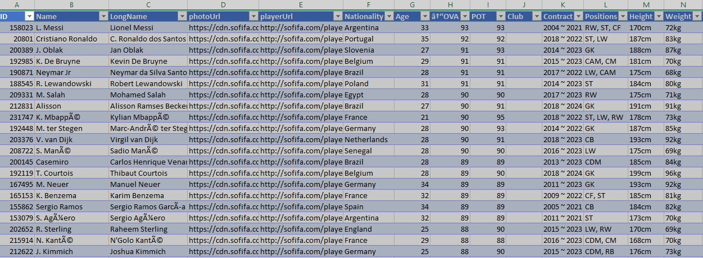 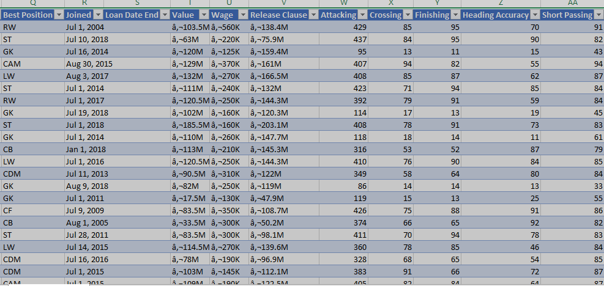

## Issues
Some of the issues that needed more attention are listed below in no particular order.

1.	Contracts 

When I originally filtered Contracts column I saw ‘free’ realized those persons had no contracts, value, wage or release clause. Therefore, I filtered the rows in descending order and deleted the top 237 rows to remove those. I removed ‘loan end date’ same dates as in contracts After changing values and splitting the column using a delimiter, I got contracted period using start and end dates also, created a column for number of years contracted. Joined was used to determine the start date for rows that didn’t have any.

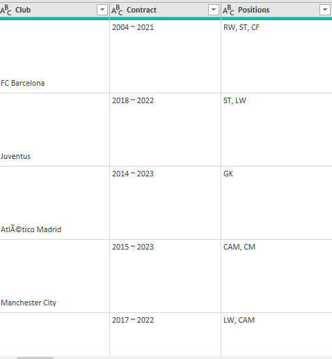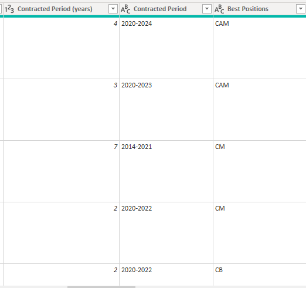

2.	Height and Weight

For each column the values we represented in two different ways. After splitting the columns by digit to non-digit, the IF function was then applied for both columns. Example: Height = IF [Height.2] = 1 then [Height.1] ELSE ([Height.1] * 30.48) + [Height.2] * 2.54)

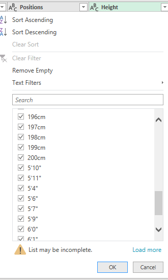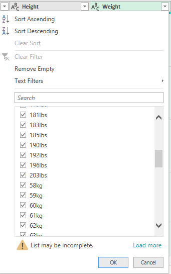

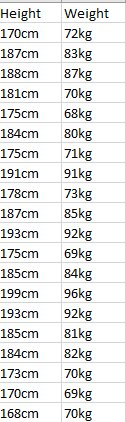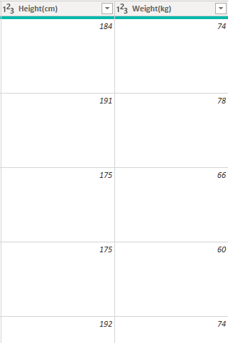

3.	 Special Characters
This proved to be not as tricky as I thought it would have been. These characters were split by using digit to non-digit the irrelevant columns created were then deleted. 

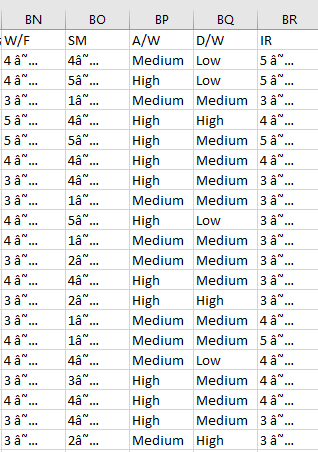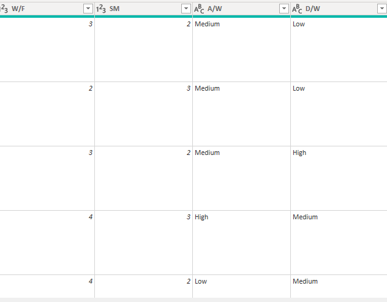

4.	Value, Wage and Release Clause

Here is where the real challenge came for me, but I overcame it. These I tried splitting digit to non-digit and when I multiplied by 1million I got incorrect figures. In the end after help from the persons within the group the IF function was used on these three columns along with the ‘Hits’ column

Wages Column =IF(RIGHT(W3,1)="M", 
LEFT(W3,LEN(W3)-1)*1000000, 
LEFT(W3,LEN(W3)-1)*1000)

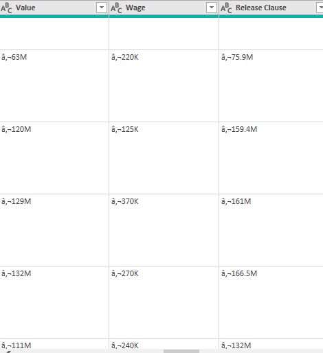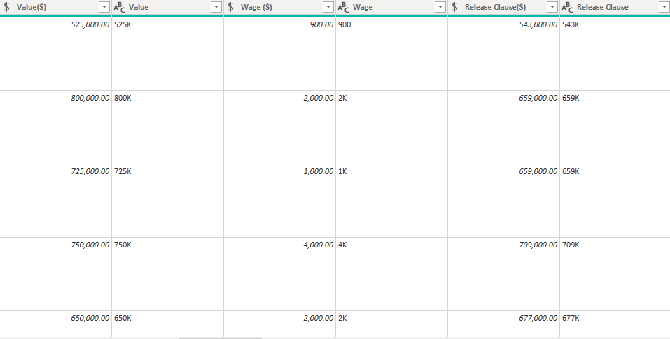

## Conclusion

This was a great learning experience, I ready to tackle more data sets putting the knowledge I gained to use, while keeping my mind open to the greater things I’m yet to learn. Thank you to the organizers and the amazing people in the community that has been created out of this challenge.

